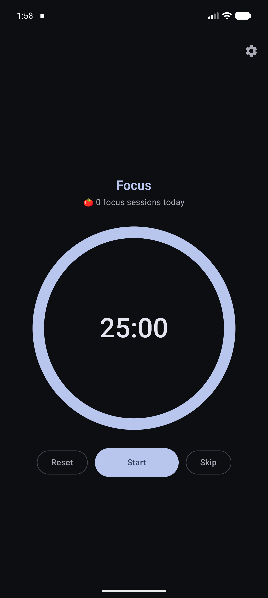
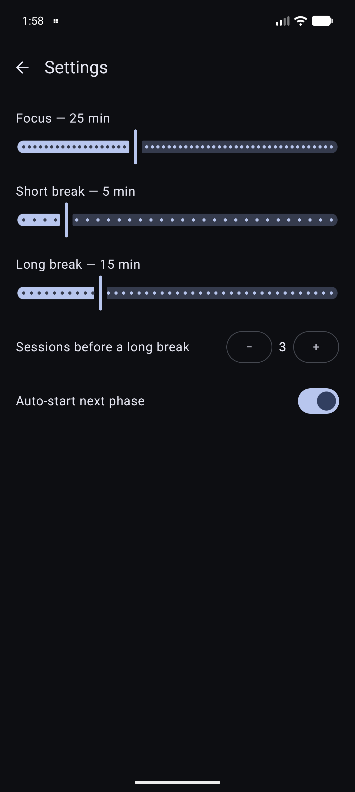

# Pomidori 🍅

[](https://github.com/Meko123456/Pomidori/actions/workflows/ci.yml)
[](LICENSE)

**პომიდორი** (*pomidori* — Georgian for "tomato") — a focused, no-nonsense
**Pomodoro timer** for Android. *Pomodoro* is Italian for "tomato", after the
tomato-shaped kitchen timer the technique is named for.

Work in focused sessions, take short breaks, and let a longer break land after a
few rounds — with a timer that keeps running when the screen is off.

## Features

- ⏱️ **Focus / break cycles** — a pure, unit-tested timer engine and cycle
  sequencer: focus → short break, with a long break every Nth focus session.
- 🔔 **Keeps running in the background** — a foreground service drives the
  countdown so it survives the screen turning off, with an ongoing notification
  and **pause / resume / skip** actions, plus a chime + buzz when a phase ends.
- ▶️ **Auto-advance** — phases roll into the next automatically (toggleable).
- 🍅 **Today's tally** — counts the focus sessions you've completed today
  (resets at midnight).
- ⚙️ **Configurable** — focus / short-break / long-break lengths, how many
  focus sessions before a long break, and auto-start, all persisted with
  **DataStore**.

## Screenshots

| Timer | Settings |
|---|---|
|  |  |

## Tech

Single-module Android app: **Jetpack Compose** + Material 3 (dynamic color), a
foreground **Service** driving the countdown over a shared `StateFlow`,
**DataStore** for settings and the daily tally, and a **pure Kotlin timer engine
+ cycle logic** that are unit-tested independently of Android.

```
timer/     Pure engine (countdown state machine) + cycle logic (phases)  — unit-tested
service/   Foreground TimerService + shared TimerController (single source of truth)
ui/        Compose timer & settings screens + ViewModels
data/      DataStore-backed settings and today's-tally repositories
```

## Build & run

```bash
./gradlew :app:installDebug        # build + install on a running device/emulator
./gradlew :app:testDebugUnitTest   # run the unit tests (engine, cycle, controller)
```

## License

[MIT](LICENSE)
