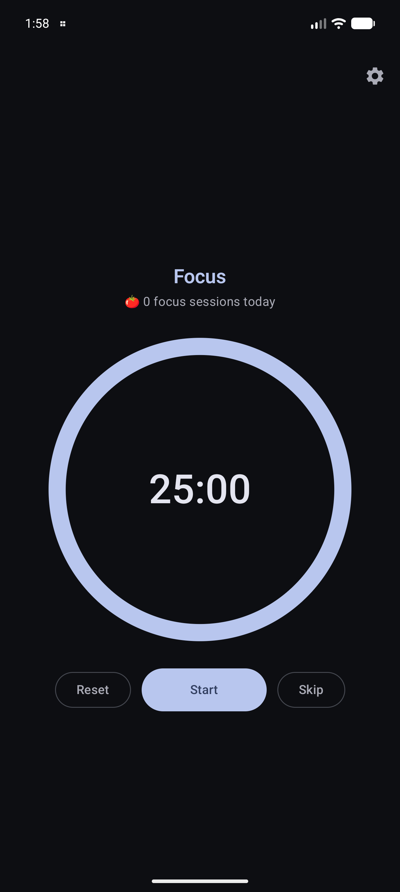
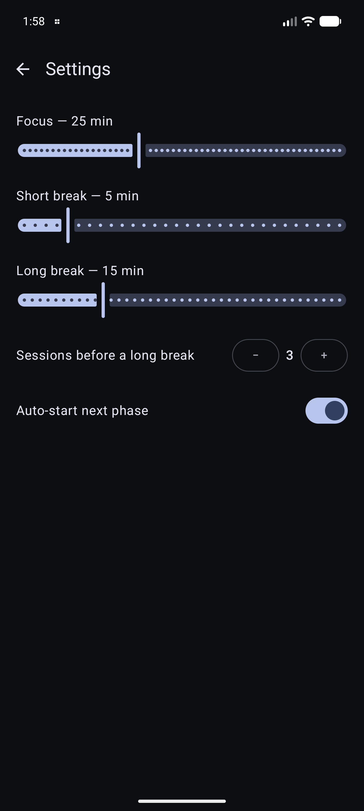
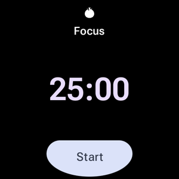
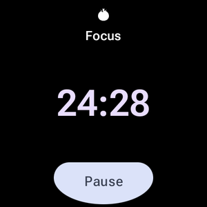
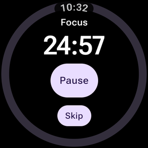

# Pomidori 🍅

[](https://github.com/Meko123456/Pomidori/actions/workflows/ci.yml)
[](LICENSE)

**პომიდორი** (*pomidori* — Georgian for "tomato") — a focused, no-nonsense
**Pomodoro timer** for Android. *Pomodoro* is Italian for "tomato", after the
tomato-shaped kitchen timer the technique is named for.

Work in focused sessions, take short breaks, and let a longer break land after a
few rounds — with a timer that keeps running when the screen is off.

## Features

- ⏱️ **Focus / break cycles** — a pure, unit-tested timer engine and cycle
  sequencer: focus → short break, with a long break every Nth focus session.
- 🔔 **Keeps running in the background** — a foreground service drives the
  countdown so it survives the screen turning off, with an ongoing notification
  and **pause / resume / skip** actions, plus a chime + buzz when a phase ends.
- ▶️ **Auto-advance** — phases roll into the next automatically (toggleable).
- 🍅 **Today's tally** — counts the focus sessions you've completed today
  (resets at midnight).
- ⚙️ **Configurable** — focus / short-break / long-break lengths, how many
  focus sessions before a long break, and auto-start, all persisted with
  **DataStore**.
- ⌚ **On the watch too** — a standalone Wear OS app with a **tile**: start,
  pause or resume a focus session from the wrist. The tile counts down by
  itself, and the session shows on the watch face as an ongoing activity.

## Screenshots

| Timer | Settings |
|---|---|
|  |  |

On Wear OS 6 — the tile before a session, the tile counting down, and the watch app:

| Tile | Tile, running | Watch app |
|---|---|---|
|  |  |  |

## Tech

**Jetpack Compose** + Material 3 (dynamic color), a foreground **Service**
driving the countdown over a shared `StateFlow`, **DataStore** for settings and
the daily tally, and a **pure Kotlin timer** in a module of its own, unit-tested
on the JVM without Android.

```
:timer        Engine (countdown state machine), cycle logic (phases) and the
              TimerController that is the single source of truth  — unit-tested
:app service/ Foreground TimerService driving the shared TimerController
:app ui/      Compose timer & settings screens + ViewModels
:app data/    DataStore-backed settings and today's-tally repositories
:wear         Wear OS app: its own foreground service over the same
              TimerController, an ongoing activity, a Compose for Wear OS
              screen, and the tile (ProtoLayout Material 3)
```

The watch runs its own timer rather than remote-controlling the phone's, so it
works with the phone out of reach. The tile is handed the moment the phase ends
and counts down to it on the watch, so it never needs an update per second.

## Build & run

```bash
./gradlew :app:installDebug        # build + install on a running device/emulator
./gradlew :wear:installDebug       # the watch app, on a Wear OS device/emulator
./gradlew :timer:test               # run the unit tests (engine, cycle, controller)
```

To put the tile on a Wear OS emulator without the tile picker:

```bash
adb shell am broadcast -a com.google.android.wearable.app.DEBUG_SURFACE \
  --es operation add-tile \
  --ecn component io.github.meko123456.pomidori/io.github.meko123456.pomidori.wear.tile.PomidoriTileService
```

## License

[MIT](LICENSE)
